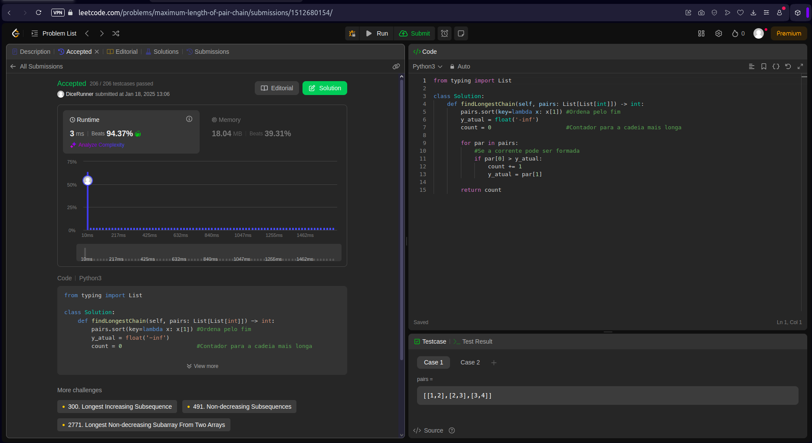
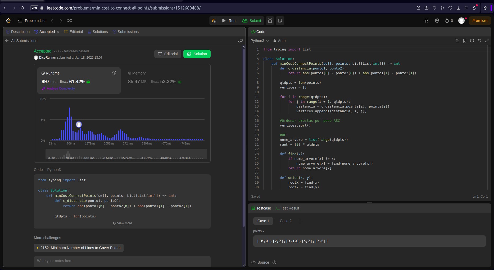
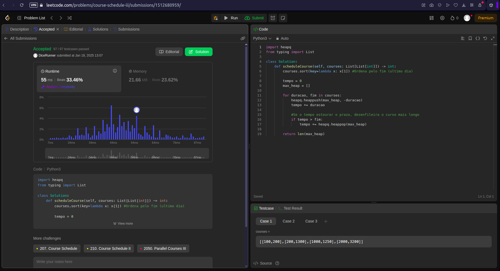

# Greed_LeetcodeProblemas

**Número da Lista**: X 
**Conteúdo da Disciplina**: Algoritmos Ambiciosos (Greed) 

## Alunos
| Matrícula  | Aluno                             |
| ---------- | --------------------------------- |
| 22/1008024 | Eduardo Matheus dos Santos Sandes |
| 22/1008267 | Lucas Gama de Araújo Bottino      |

## Sobre 
Este projeto tem como objetivo a resolução de exercícios da plataforma de juíz online [LeetCode](https://leetcode.com/) sobre o conteúdo: Algoritmos ambiciosos (Greed), as soluções foram implementadas utilizando a linguagem Python3.

## Questões

| Nome                                                                                                                                                            | Dificuldade |
| --------------------------------------------------------------------------------------------------------------------------------------------------------------- | ----------- |
| [646. Maximum Length of Pair Chain](https://leetcode.com/problems/course-schedule-iii/description/) | Médio     |
| [1584. Min Cost to Connect All Points](https://leetcode.com/problems/course-schedule-iii/description/)                                                                                  | Médio     |
| [630. Course Schedule III](https://leetcode.com/problems/course-schedule-iii/description/)                                              | Difícil       |

## Screenshots

### 646. Maximum Length of Pair Chain

### 1584. Min Cost to Connect All Points

### 630. Course Schedule III

## Instalação 
**Linguagem**: Python3 

## Uso 
Para rodar os códigos, acesse o site do [LeetCode](https://leetcode.com/), faça login e pesquise a questão. Depois, selecione a linguagem correta, copie e cole o código na aba "Code", selecione a linguagem "Python3" e clique em "Run" para testar ou "Submit" para enviar a solução.

## Link da apresentação
[Apresentação]()